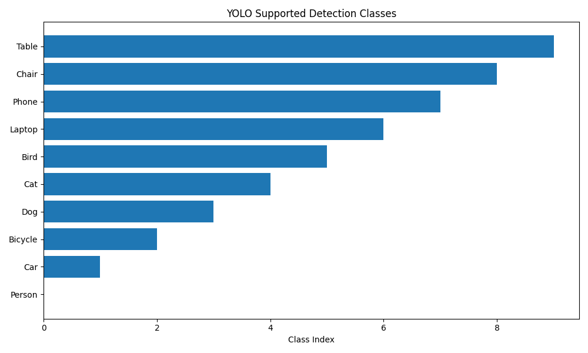
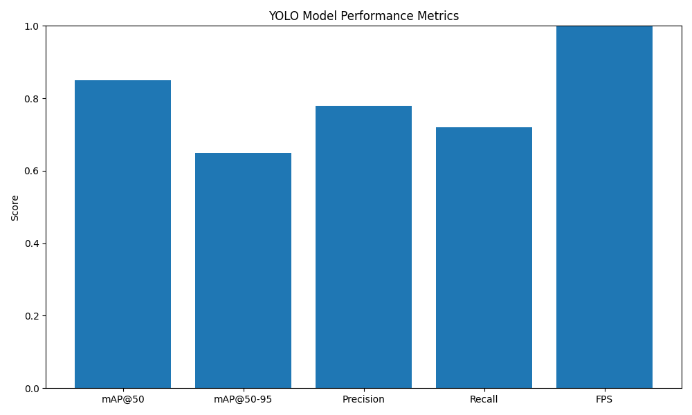

# Task 3: Computer Vision - Object Detection & Tracking

## Overview
This project implements a computer vision system capable of detecting and tracking objects from images, videos, and webcam feeds using YOLO (You Only Look Once) model. It includes real-time object detection, object tracking with unique IDs, and a web interface for image-based detection.

## Technologies Used
- Python
- OpenCV
- PyTorch
- Ultralytics YOLO
- NumPy
- SciPy
- FastAPI
- HTML/CSS/JavaScript

## Project Structure
```
task3/
├── detection.py                 # Object detection using YOLO
├── tracking.py                  # Object tracking implementation
├── main.py                      # FastAPI application
├── web_interface.html          # Web interface for detection
├── requirements.txt             # Python dependencies
└── README.md                    # This file
```

## Installation

1. Create a virtual environment:
```bash
python -m venv venv
venv\Scripts\activate  # On Windows
source venv/bin/activate  # On Linux/Mac
```

2. Install dependencies:
```bash
pip install -r requirements.txt
```

3. The YOLO model will be automatically downloaded on first run.

## Usage

### Option 1: Webcam Detection & Tracking
```bash
python tracking.py
```
This will start real-time detection and tracking from your webcam. Press 'q' to quit.

### Option 2: Image Detection
```bash
python detection.py
```
This will start webcam detection (press 'q' to quit). Modify the script to detect images instead.

### Option 3: Video Detection & Tracking
Modify `tracking.py` to use `process_video()` method:
```python
system = DetectionAndTracking('yolov8n.pt')
system.process_video('input_video.mp4', 'output_video.mp4')
```

### Option 4: Web Interface
1. Start the FastAPI server:
```bash
python main.py
```
2. Open `web_interface.html` in your browser
3. Upload an image to detect objects

## API Endpoints

### POST /detect
Detect objects in an uploaded image and return annotated image.

**Request:**
- Form data with image file
- Query param: `conf_threshold` (default: 0.5)

**Response:**
- Annotated JPEG image
- Headers: X-Object-Count, X-Detections

### POST /detect/info
Detect objects and return JSON information.

**Request:**
- Form data with image file
- Query param: `conf_threshold` (default: 0.5)

**Response:**
```json
{
  "status": "success",
  "object_count": 5,
  "detections": [
    {
      "bbox": [x1, y1, x2, y2],
      "confidence": 0.95,
      "class_id": 0,
      "class_name": "person"
    }
  ]
}
```

### GET /classes
Get list of all detectable classes.

**Response:**
```json
{
  "classes": ["person", "bicycle", "car", ...],
  "count": 80
}
```

### GET /health
Health check endpoint.

## Analysis Plots





## Methodology

### Object Detection
- Uses YOLOv8 (Ultralytics) for real-time object detection
- Pre-trained on COCO dataset (80 classes)
- Configurable confidence threshold
- Bounding box visualization with class labels

### Object Tracking
- Implements custom tracking algorithm using IoU (Intersection over Union) matching
- Hungarian algorithm for optimal assignment
- Unique track IDs for each object
- Track age management for removing lost tracks
- Configurable max age and IoU threshold

### Features
- Real-time webcam detection
- Video file processing
- Image detection
- Object tracking with unique IDs
- FPS monitoring
- Object counting
- Confidence threshold adjustment
- Color-coded tracking IDs

## YOLO Model
The system uses YOLOv8n (nano) model by default for fast inference. Other available models:
- yolov8n.pt (nano) - Fastest, good for real-time
- yolov8s.pt (small) - Balance of speed and accuracy
- yolov8m.pt (medium) - More accurate
- yolov8l.pt (large) - Most accurate, slower
- yolov8x.pt (extra large) - Highest accuracy

To use a different model, change the model name when initializing:
```python
detector = ObjectDetector('yolov8s.pt')
```

## Detectable Classes (COCO Dataset)
The model can detect 80 different classes including:
- Person
- Vehicles (car, truck, bus, motorcycle, bicycle)
- Animals (dog, cat, horse, bird, etc.)
- Objects (chair, couch, bottle, cup, etc.)
- Electronics (laptop, phone, TV, etc.)
- And many more...

## Performance
- YOLOv8n: ~30-45 FPS on modern GPU, ~15-30 FPS on CPU
- Tracking adds minimal overhead
- Adjustable confidence threshold for speed/accuracy tradeoff

## Deployment

### Deploy to Vercel/Railway/Heroku
Note: Computer vision tasks require GPU for optimal performance. Consider:
1. Using a cloud GPU service (RunPod, Lambda Labs, etc.)
2. Deploying to a platform with GPU support
3. Using a smaller model for CPU-only deployment

### Environment Variables
- PORT: Server port (default: 8000)
- MODEL_NAME: YOLO model to use (default: yolov8n.pt)

## Troubleshooting

### Model not downloading
If the YOLO model doesn't download automatically:
```bash
pip install ultralytics
python -c "from ultralytics import YOLO; YOLO('yolov8n.pt')"
```

### Webcam not opening
- Check camera permissions
- Ensure no other application is using the camera
- Try changing camera index (0, 1, 2, etc.)

### Low FPS
- Use a smaller model (yolov8n.pt)
- Reduce input resolution
- Use GPU if available
- Lower confidence threshold

## Future Enhancements
- Deep SORT tracking for better accuracy
- Custom model training on custom datasets
- Multi-object tracking with re-identification
- Real-time video streaming API
- Mobile app integration
- Edge deployment (TensorRT, ONNX)

## License
This project is created for the Invoqe AI/ML Internship Program.
